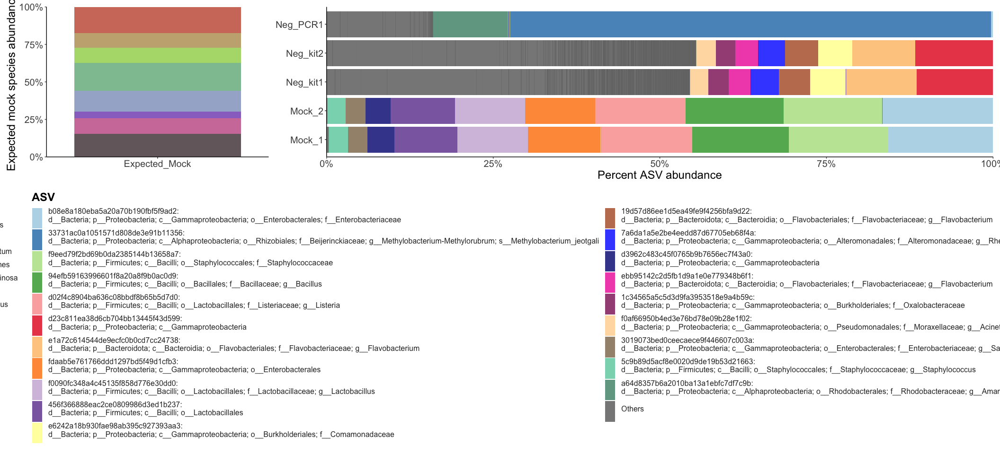
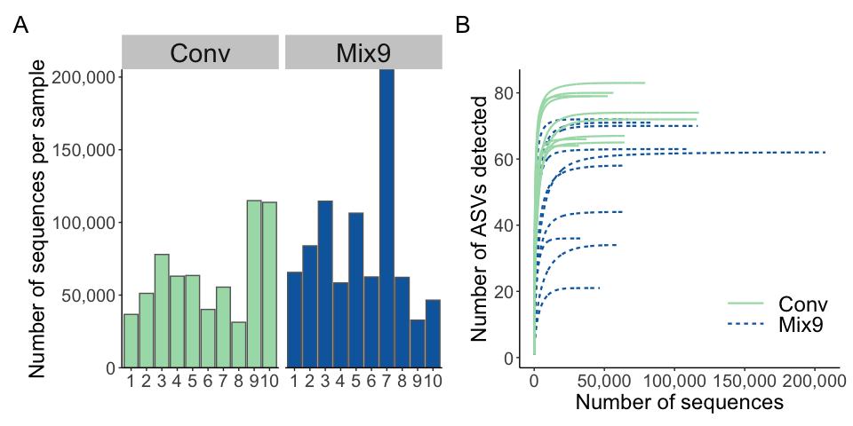
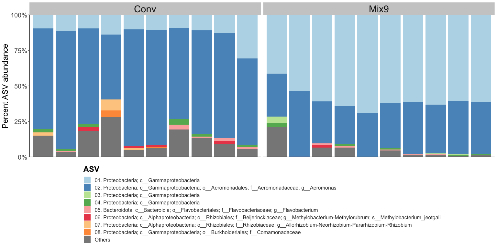
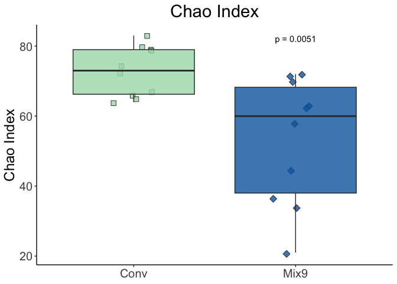
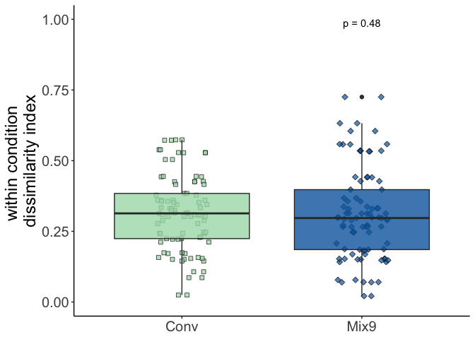

# About the Data

## Conditions

During Trial 47. Fish collected on day 7.

-   Conventional
-   Mix9

| ID  |     SeqName     | SampleName  | Project | FishType | SampleRep |
|:---------:|:---------:|:---------:|:---------:|:---------:|:---------:|
| 71  |    71_Mix9_1    |   Mix9_1    |  Flavo  |   Mix9   |     1     |
| 72  |    72_Mix9_2    |   Mix9_2    |  Flavo  |   Mix9   |     2     |
| 73  |    73_Mix9_3    |   Mix9_3    |  Flavo  |   Mix9   |     3     |
| 74  |    74_Mix9_4    |   Mix9_4    |  Flavo  |   Mix9   |     4     |
| 75  |    75_Mix9_5    |   Mix9_5    |  Flavo  |   Mix9   |     5     |
| 76  |    76_Mix9_6    |   Mix9_6    |  Flavo  |   Mix9   |     6     |
| 77  |    77_Mix9_7    |   Mix9_7    |  Flavo  |   Mix9   |     7     |
| 78  |    78_Mix9_8    |   Mix9_8    |  Flavo  |   Mix9   |     8     |
| 79  |    79_Mix9_9    |   Mix9_9    |  Flavo  |   Mix9   |     9     |
| 80  |   80_Mix9_10    |   Mix9_10   |  Flavo  |   Mix9   |    10     |
| 86  |    86_Conv_1    |   Conv_1    |  Flavo  |   Conv   |     1     |
| 87  |    87_Conv_2    |   Conv_2    |  Flavo  |   Conv   |     2     |
| 88  |    88_Conv_3    |   Conv_3    |  Flavo  |   Conv   |     3     |
| 89  |    89_Conv_4    |   Conv_4    |  Flavo  |   Conv   |     4     |
| 90  |    90_Conv_5    |   Conv_5    |  Flavo  |   Conv   |     5     |
| 91  |    91_Conv_6    |   Conv_6    |  Flavo  |   Conv   |     6     |
| 92  |    92_Conv_7    |   Conv_7    |  Flavo  |   Conv   |     7     |
| 93  |    93_Conv_8    |   Conv_8    |  Flavo  |   Conv   |     8     |
| 94  |    94_Conv_9    |   Conv_9    |  Flavo  |   Conv   |     9     |
| 95  |   95_Conv_10    |   Conv_10   |  Flavo  |   Conv   |    10     |

## Sampling

1.  Transfer fish into a small petri dish full of sterile water (wash #1).
2.  Wash the fish again by transferring into a new petri dish full of sterile water (wash #2).
3.  Add 5 washed fish per tube into 5 x 2 mL tubes, with 500 µL of water
4.  After all samples have been collected for all conditions, remove as much water as possible with a p200 pipette
5.  Put the samples at -80C

## Sequencing

16S V6 region

*Primers*

1064R GTCTCGTGGGCTCGGAGATGTGTATAAGAGACAGCGACRRCCATGCANCACCT\
967F-A TCGTCGGCAGCGTCAGATGTGTATAAGAGACAGCTAACCGANGAACCTYACC\
967F-B TCGTCGGCAGCGTCAGATGTGTATAAGAGACAGCNACGCGAAGAACCTTANC\
967F-C TCGTCGGCAGCGTCAGATGTGTATAAGAGACAGCAACGCGMARAACCTTACC\
967F-D TCGTCGGCAGCGTCAGATGTGTATAAGAGACAGATACGCGARGAACCTTACC

2 x 250 bp paired-end Illumina sequencing

## Analysis

Initially done with QIIME2, dada2 denoising. Eukaryotic reads removed here.

# Setup

## Load libraries and settings


```r
library(tidyverse)
library(scales)
library(ggpubr)
library(qiime2R)
library(vegan)
library(gt)
library(patchwork)
library(UpSetR)
library(gplots)
library(ComplexHeatmap)

# set global theme
theme_set(theme_classic()+
             theme(legend.position ="none",
                   axis.title = element_text(size=18),
                   legend.title = element_text(size=18, face="bold"),
                   axis.text = element_text(size=15), 
                   plot.background = element_blank(),
                   legend.text = element_text(size=18),
                   strip.text = element_text(size=22), 
                   plot.title = element_text(hjust=0.5, size=22),
                   strip.background = element_rect(fill="grey80", color="transparent")))

set.seed(532)

# set global options for code output
knitr::opts_chunk$set(echo=TRUE, warning=FALSE,message=FALSE)
```

## Import data


```r
# set file paths for metadata and qiime2 output
metadatafile <- "Mix9Conv16Samplicon_metadata.txt"
tablefile <- "../qiime2output/table.qza"
taxonomyfile <- "../qiime2output/taxonomy.qza"
treefile <- "../qiime2output/rooted-tree.qza"

# make ASV table per sample
SVs<-read_qza(tablefile)$data

# make dataframe from metadata
rawmetadata<-read_q2metadata(metadatafile)

# make dataframe of taxomony per ASV
taxonomy<-read_qza(taxonomyfile)$data %>% parse_taxonomy()
```

## Clean up data


```r
# vector of eukaryotic ASVs
eukASVs <- taxonomy %>% filter(Kingdom=="d__Eukaryota" | Phylum=='Cyanobacteria') %>%
   rownames_to_column("ASVs")

# clean up ASV data
datafullASVs <- 
   # transpose ASV matrix and make dataframe
   t(SVs) %>% as.data.frame() %>% 
   # set sample names as a column
   rownames_to_column("SampleID") %>% 
   # add in the metadata
   full_join(rawmetadata) %>%
   # make into long form
   pivot_longer("cca00a58137be2c40384b70e46bda58e":"213dc85b14c8cdc3e765c92bcc6fa6a2") %>% 
   # select only Mix9/Conv data
   filter(Project=="Flavo") %>% 
   filter(LoperamidePathogen != "F. columnare") %>% 
   # remove eukaryotic ASVs
   filter(!name %in% eukASVs$ASVs)

# clean up ASV data to remove taxa <0.1%
datafullASVscutoff <- datafullASVs %>% 
   # calculate percent abundance from counts
   group_by(SampleID) %>% mutate(percent=value/sum(value)) %>% 
   # remove ASVs <0.1%
   filter(percent>0.001) %>% 
   # add in all taxonomy data
   left_join(taxonomy %>% rownames_to_column("name"))

# clean up metadata, remove samples not used for the figures
metadata <- filter(rawmetadata, Project=="Flavo") %>% 
   filter(LoperamidePathogen != "F. columnare")

# clean up ASV matrix table
SVsControls <- 
   # select only Mix9 & Conventional samples based on the metadata
   select(as.data.frame(SVs), metadata$SampleID) %>%
   # set ASV names as a column
   rownames_to_column("ASV") %>% 
   # filter out ASVs <0.1% like above
   filter(ASV %in% datafullASVscutoff$name) %>% 
   # set ASV names as rownames, then transpose
   column_to_rownames(var="ASV") %>% t()

# check that the ASVs in datafullASVscutoff match SVsControls
setdiff(colnames(SVsControls), unique(datafullASVscutoff$name))
```

```
## character(0)
```

-----

# General QC

## Sequencing controls


```r
# expected mock abundances and plot
mockplot <- data_frame(SampleName="Expected_Mock",value=0,
   MockTaxa=factor(c("Pseudomonas aeruginosa", "Escherichia coli", 
                     "Salmonella enterica", "Enterococcus faecalis", 
                     "Lactobacillus fermentum","Staphylococcus aureus", 
                     "Listeria monocytogenes", "Bacillus subtilis")),
   percent=c(4.2,10.1,10.4,9.9,18.4,15.5,14.1,17.4)) %>% 
   ggplot(aes(x=SampleName, y=percent, fill=MockTaxa))+
   geom_col(position="fill", alpha=0.8)+
   theme(legend.text = element_text(size=12, colour="gray20", margin = margin(b = 10, unit = "pt")),
         legend.position = "bottom",legend.direction = "vertical",
         axis.ticks.y = element_line(inherit.blank=FALSE, color="grey30"))+
   scale_fill_manual(values=c("#c5543a","#b8995a","#9cd250","#6eb386",
                              "#8c9fc3","#7e4abb","#c45891","#4b393e"))+
   scale_y_continuous(labels = scales::percent_format(), expand=c(0,0))+
   labs(y="Expected mock species abundance",x=NULL,fill="Mock species")

# sequenced blank and mock control plot
seqmocks <- 
   # transpose ASV matrix and make dataframe
   t(SVs) %>% as.data.frame() %>% 
   # set sample names as a column
   rownames_to_column("SampleID") %>% 
   # add in the metadata
   full_join(rawmetadata) %>%
   # make into long form
   pivot_longer("cca00a58137be2c40384b70e46bda58e":"213dc85b14c8cdc3e765c92bcc6fa6a2") %>% 
   # select only control data
   filter(Project=="Controls") %>% 
   # add in taxonomy and new column of ASV name
   left_join(read_qza(taxonomyfile)$data, by=c("name"="Feature.ID")) %>% 
   unite("ASVname", c("name", "Taxon"), sep=": \n") %>% 
   # filter just top 20 taxa, group all Others
   mutate(TaxaOther=forcats::fct_lump_n(f=ASVname, w=value, other_level="Others", n=20)) %>% 
   mutate(TaxaOther=reorder(TaxaOther, -value)) %>%
   # calculate percentages per taxa per Sample
   group_by(SampleName) %>% mutate(percent=value/sum(value)) %>%  
   # start plotting
   ggplot(aes(y=SampleName, x=percent, fill=TaxaOther))+
   geom_col(position="fill", alpha=0.8)+
   theme(legend.text = element_text(size=12, colour="gray20", margin = margin(b = 10, unit = "pt")),
         legend.position = "bottom",legend.direction = "vertical",
         axis.ticks.x = element_line(inherit.blank=FALSE, color="grey30"))+
   scale_fill_manual(values=c("#A6CEE3", "#1F78B4", "#B2DF8A", "#33A02C", "#FB9A99", "#E31A1C", "#FDBF6F", "#FF7F00", 
              "#CAB2D6", "#6A3D9A", "#FFFF99", "#B15928","blue1","navy",
              "maroon2","maroon4","burlywood1","burlywood4","aquamarine3","aquamarine4","grey40"))+
   scale_x_continuous(labels = scales::percent_format(), expand=c(0,0))+
   labs(x="Percent ASV abundance",y=NULL,fill="ASV")

# plot together
mockplot+seqmocks+plot_layout(guides="collect", widths = c(1,3)) & theme(legend.position = "bottom")
```

<!-- -->


## Reads per sample


```r
reads <-datafullASVscutoff %>% 
   group_by(SampleID) %>% mutate(sumreads=sum(value)) %>% distinct(Condition, SampleRep, SampleID, sumreads) %>% 
   # set order of samples 1-10
   mutate(SampleRep=factor(SampleRep, levels=unique(SampleRep))) %>% 
   # start plotting
   ggplot(aes(x=SampleRep, y=sumreads, fill=Condition))+
   # panel per fish type
   facet_grid(.~Condition, scales="free", space="free")+
   geom_col(color="grey40")+
   scale_fill_manual(values = c("#a8ddb5","#0868ac"))+
   scale_y_continuous(expand=c(0,0), labels=scales::label_comma())+
   labs(y="Number of sequences per sample",x=NULL,fill=NULL)
reads
```

<!-- -->


## Rarefaction curves


```r
# number of ASVs per sample
(S <- specnumber(SVsControls))
```

```
##  71-Mix9-1  72-Mix9-2  73-Mix9-3  74-Mix9-4  75-Mix9-5  76-Mix9-6  77-Mix9-7 
##         72         71         70         34         63         58         62 
##  78-Mix9-8  79-Mix9-9 80-Mix9-10  86-Conv-1  87-Conv-2  88-Conv-3  89-Conv-4 
##         44         36         21         66         79         83         65 
##  90-Conv-5  91-Conv-6  92-Conv-7  93-Conv-8  94-Conv-9 95-Conv-10 
##         67         79         80         64         74         72
```

```r
# smallest number of reads in a sample
(raremax <- min(rowSums(SVsControls)))
```

```
## [1] 31920
```

```r
# rarefied number of taxa per sample
Srare <- vegan::rarefy(SVsControls, raremax)
# slope at the end of the rarefacetion curve per sample
Sslope <- vegan::rareslope(SVsControls, raremax)

# plot observed vs rarefied number of ASVs
plot(S, Srare, xlab = "Observed No. of ASVs", ylab = "Rarefied No. of ASVs")
abline(0,1)
```

<!-- -->

```r
# plot slopes
plot(S, Sslope, xlab = "Observed No. of ASVs", ylab = "Slope at rarefied sample size")
```

<!-- -->

```r
# store rarefaction curves data with 100 steps
rarecurve_data <- rarecurve(SVsControls, step = 100, sample = raremax)
```

<!-- -->

```r
# clean plot of rarefaction curves
rareplot<-map_dfr(rarecurve_data, bind_rows) %>% 
   bind_cols(SampleID = rownames(SVsControls),.) %>%
   pivot_longer(-SampleID) %>%
   drop_na() %>%
   mutate(n_seqs = as.numeric(str_replace(name, "N", ""))) %>%
   select(-name) %>%
   left_join(metadata) %>% 
   ggplot(aes(x=n_seqs, y=value, group=SampleID, color=FishType, lty=FishType)) +
   geom_line(lwd=0.8) +
   scale_color_manual(values = c("#a8ddb5","#0868ac"))+
   scale_fill_manual(values = c("#a8ddb5","#0868ac"))+
   scale_x_continuous(labels=label_comma())+
   theme(legend.key.width = unit(1.33,"cm"), legend.position=c(0.8,0.2))+
   labs(x = "Number of sequences", y="Number of ASVs detected", color=NULL, lty=NULL)
```

### Summary figure


```r
((reads+rareplot) + plot_annotation(tag_levels = "A")) &
  theme(plot.tag = element_text(size=20))
```

<!-- -->

```r
ggsave("../figures/Mix9Conv_seqQC.png", bg="transparent", width=11, height=5.5)
ggsave("../figures/Mix9Conv_seqQC.pdf", bg="transparent", width=11, height=5.5)
```

----


# Taxa Bar plots


## Phylum level


```r
# set palette
palettep <- c("#D95F02", "#E6AB02","skyblue", "#1B9E77","midnightblue","grey50")

phylabars <- datafullASVscutoff %>% 
   # replace NAs with Unknown and remove "d__Bacteria; " from the start of every phyla
   mutate(Phylum=replace_na(Phylum, "Unknown"),
          Phylum=str_remove(Phylum, "d__Bacteria; ")) %>% 
   group_by(SampleName,Phylum) %>% mutate(sumreads=sum(value)) %>% distinct(Condition,SampleName, Phylum, sumreads) %>% 
   # start plotting
   ggplot(aes(x=SampleName, y=sumreads, fill=Phylum))+
   facet_grid(.~Condition, scales="free", space="free")+
   geom_col(position="fill", alpha=0.8)+
   theme(legend.position = c(0.85, 0.6), legend.background = element_rect(fill=alpha("white", 0.8), color = "transparent"),
         axis.text.x = element_blank(), 
         axis.ticks.y = element_line(inherit.blank=FALSE, color="grey30"),
         axis.ticks.x = element_blank())+
   scale_fill_manual(values=palettep)+
   scale_y_continuous(labels = scales::percent_format(), expand=c(0,0))+
   labs(y="Percent phyla abundance",x=NULL,fill="Phylum")
phylabars
```

<!-- -->


## ASV level


```r
# set palette
palettess<-c("#A6CEE3", "#1F78B4", "#B2DF8A", "#33A02C", "#FB9A99","#E31A1C", "#FDBF6F", "#FF7F00","grey40",
             "#CAB2D6", "#6A3D9A", "#FFFF99", "#B15928")

asvbars <- datafullASVscutoff %>% 
   # add in full taxonomy data
   left_join(read_qza(taxonomyfile)$data, by=c("name"="Feature.ID")) %>% 
   # make new column with all ASV name info
   unite("ASVname", c("name", "Taxon"), sep=": ") %>% 
   # remove "d__Bacteria; " from the start of every phyla
   mutate(ASVname=str_remove(ASVname, "d__Bacteria; p__"),
          # select the 8 most abundant phyla, then group all the Others
          TaxaOther=forcats::fct_lump_n(f=ASVname, w=value, other_level="Others", n=4),
          # reorder based on abundance
          TaxaOther=reorder(TaxaOther, -value),
          # set order so that Others is last
          TaxaOther=factor(TaxaOther, levels=c("4de03c7aceccf0fcb66b3589366454da: Proteobacteria; c__Gammaproteobacteria",
                              "cca00a58137be2c40384b70e46bda58e: Proteobacteria; c__Gammaproteobacteria; o__Aeromonadales; f__Aeromonadaceae; g__Aeromonas", "d3962c483c45f0765b9b7656ec7f43a0: Proteobacteria; c__Gammaproteobacteria", "d23c811ea38d6cb704bb13445f43d599: Proteobacteria; c__Gammaproteobacteria", "e1a72c614544de9ecfc0b0cd7cc24738: Bacteroidota; c__Bacteroidia; o__Flavobacteriales; f__Flavobacteriaceae; g__Flavobacterium", "33731ac0a1051571d808de3e91b11356: Proteobacteria; c__Alphaproteobacteria; o__Rhizobiales; f__Beijerinckiaceae; g__Methylobacterium-Methylorubrum; s__Methylobacterium_jeotgali", "361adfa667ee066fef8a0338a15f6305: Proteobacteria; c__Alphaproteobacteria; o__Rhizobiales; f__Rhizobiaceae; g__Allorhizobium-Neorhizobium-Pararhizobium-Rhizobium", "b952fbdeade9c15bba8587fa6091b67f: Proteobacteria; c__Gammaproteobacteria; o__Burkholderiales; f__Comamonadaceae","Others"))) %>% 
   # calculate the total number of reads per grouped/Other taxa
   group_by(Condition, SampleName, TaxaOther) %>% 
   summarize(valuesum = sum(value)) %>% ungroup() %>%
   # start plotting
   ggplot(aes(x=SampleName, y=valuesum, fill=TaxaOther))+
   facet_grid(.~Condition, scales="free", space="free")+
   geom_col(position="fill", alpha=0.8)+
   theme(legend.text = element_text(size=12, colour="gray20"),
         legend.position = "bottom",legend.direction = "vertical", axis.text.x = element_blank(), 
         axis.ticks.x = element_blank(),
         axis.ticks.y = element_line(inherit.blank=FALSE, color="grey30"))+
   scale_fill_manual(values=c(palettess),
                     labels=c("4de03c7aceccf0fcb66b3589366454da: Proteobacteria; c__Gammaproteobacteria" = 
                                       "01. Proteobacteria; c__Gammaproteobacteria",
                              "cca00a58137be2c40384b70e46bda58e: Proteobacteria; c__Gammaproteobacteria; o__Aeromonadales; f__Aeromonadaceae; g__Aeromonas" = 
                                       "02. Proteobacteria; c__Gammaproteobacteria; o__Aeromonadales; f__Aeromonadaceae; g__Aeromonas",
                              "d3962c483c45f0765b9b7656ec7f43a0: Proteobacteria; c__Gammaproteobacteria" = 
                                       "03. Proteobacteria; c__Gammaproteobacteria",
                              "d23c811ea38d6cb704bb13445f43d599: Proteobacteria; c__Gammaproteobacteria" =
                                       "04. Proteobacteria; c__Gammaproteobacteria",
                              "e1a72c614544de9ecfc0b0cd7cc24738: Bacteroidota; c__Bacteroidia; o__Flavobacteriales; f__Flavobacteriaceae; g__Flavobacterium" = 
                                       "05. Bacteroidota; c__Bacteroidia; o__Flavobacteriales; f__Flavobacteriaceae; g__Flavobacterium",
                              "33731ac0a1051571d808de3e91b11356: Proteobacteria; c__Alphaproteobacteria; o__Rhizobiales; f__Beijerinckiaceae; g__Methylobacterium-Methylorubrum; s__Methylobacterium_jeotgali" = 
                                       "06. Proteobacteria; c__Alphaproteobacteria; o__Rhizobiales; f__Beijerinckiaceae; g__Methylobacterium-Methylorubrum; s__Methylobacterium_jeotgali",
                              "361adfa667ee066fef8a0338a15f6305: Proteobacteria; c__Alphaproteobacteria; o__Rhizobiales; f__Rhizobiaceae; g__Allorhizobium-Neorhizobium-Pararhizobium-Rhizobium" = 
                                       "07. Proteobacteria; c__Alphaproteobacteria; o__Rhizobiales; f__Rhizobiaceae; g__Allorhizobium-Neorhizobium-Pararhizobium-Rhizobium",
                              "b952fbdeade9c15bba8587fa6091b67f: Proteobacteria; c__Gammaproteobacteria; o__Burkholderiales; f__Comamonadaceae" = 
                                       "08. Proteobacteria; c__Gammaproteobacteria; o__Burkholderiales; f__Comamonadaceae",
                              "Others" = "Others"))+
   scale_y_continuous(labels = scales::percent_format(), expand=c(0,0))+
   labs(y="Percent ASV abundance", x=NULL, fill="ASV")
asvbars
```

<!-- -->

### Summary figure


```r
(phylabars/asvbars)+plot_annotation(tag_levels = "A") &
  theme(plot.tag = element_text(size=20))
```

<!-- -->

```r
ggsave("../figures/Mix9ConvBars.png", bg="transparent", width=13, height=11)
ggsave("../figures/Mix9ConvBars.pdf", bg="transparent", width=13, height=11)
```


-----

# Venn Diagrams

At the ASV level


```r
# list of conv ASVs
convset <- datafullASVscutoff %>% ungroup() %>% filter(Condition=="Conv") %>% distinct(name) %>% .$name
# list of Mix9 ASVs
mix9set <- datafullASVscutoff %>% ungroup() %>% filter(Condition=="Mix9") %>% distinct(name) %>% .$name

# plot venn diagram
vennd <- ggVennDiagram::ggVennDiagram(list("Conv" = convset, "Mix9" = mix9set),
                                      edge_lty = c('solid',"dashed"), set_size = 8,
                                      label_alpha = 0,label_size = 6)+
   scale_color_manual(values = c("#a8ddb5","#0868ac"))+
   scale_fill_gradient(low="white",high="grey50")+
   coord_sf(clip = 'off')+theme(legend.position = "none")
vennd
```

<!-- -->


-----

# Alpha Diversity

## Richness chao


```r
# calculate chao diversity
chao <- estimateR(SVsControls) %>% t() %>% as.data.frame()
# add into metadata as column Chao
metadata$Chao <- chao$S.chao1

# plot Chao
metadata %>% 
   ggplot(aes(x=Condition,y=Chao, fill=Condition, shape=Condition))+
   geom_jitter(width=0.15, size=3, alpha=0.8)+
   geom_boxplot(alpha=0.8)+
   stat_compare_means(ref.group="Conv", label = "p.format", vjust=1)+
   labs(title="Chao Index", x=NULL,y="Chao Index",fill="Condition")+
   scale_fill_manual(values = c("#a8ddb5","#0868ac"))+
   scale_shape_manual(values=c(22,23))
```

<!-- -->

## Simpsons and Shannon


```r
# calculate diversity
diversityshannon<-diversity(SVsControls, index="shannon")
diversitysimpsons<-diversity(SVsControls, index="simpson")
# add into metadata variable
metadata$Simpsons<-diversitysimpsons
metadata$Shannon<-diversityshannon

# plot chao, simpsons, shannon
divplot <- metadata %>% 
   pivot_longer(Chao:Shannon, names_to="DiversityIndex", values_to="Value") %>% 
   ggplot(aes(x=Condition,y=Value, fill=Condition, shape=Condition))+
   geom_jitter(width=0.15, size=3, alpha=0.8)+
   geom_boxplot(alpha=0.8)+
   facet_wrap(~DiversityIndex, scales="free")+
   stat_compare_means(ref.group="Conv", label = "p.format")+
   labs(x=NULL, y="Index of Diversity",fill="LoperamideTimepoint")+
   scale_fill_manual(values = c("#a8ddb5","#0868ac"))+
   scale_shape_manual(values=c(22,23))+
   scale_y_continuous(expand = expansion(mult = c(0.1, .1)), limits=c(0,NA))
divplot 
```

<!-- -->


-----


# Beta Diversity


```r
# ellipse function
veganCovEllipse<-function (cov, center = c(0, 0), scale = 1, npoints = 100)
{theta <- (0:npoints) * 2 * pi/npoints
   Circle <- cbind(cos(theta), sin(theta))
   t(center + scale * t(Circle %*% chol(cov)))}
```


```r
# calculate beta-diversity
sol<-metaMDS(SVsControls,distance = "bray", k = 2, trymax = 200)
```

```
## Square root transformation
## Wisconsin double standardization
## Run 0 stress 0.05595685 
## Run 1 stress 0.05595672 
## ... New best solution
## ... Procrustes: rmse 0.0001802062  max resid 0.0005302712 
## ... Similar to previous best
## Run 2 stress 0.05595678 
## ... Procrustes: rmse 0.0001242307  max resid 0.0003865361 
## ... Similar to previous best
## Run 3 stress 0.05595677 
## ... Procrustes: rmse 0.0001061366  max resid 0.0003173493 
## ... Similar to previous best
## Run 4 stress 0.06846451 
## Run 5 stress 0.08568277 
## Run 6 stress 0.05595683 
## ... Procrustes: rmse 0.0001744514  max resid 0.0005330084 
## ... Similar to previous best
## Run 7 stress 0.06300219 
## Run 8 stress 0.06522956 
## Run 9 stress 0.05595702 
## ... Procrustes: rmse 0.0002989589  max resid 0.0009239083 
## ... Similar to previous best
## Run 10 stress 0.06522912 
## Run 11 stress 0.06300223 
## Run 12 stress 0.06522914 
## Run 13 stress 0.06846447 
## Run 14 stress 0.06522923 
## Run 15 stress 0.08695491 
## Run 16 stress 0.06846448 
## Run 17 stress 0.06300218 
## Run 18 stress 0.06300211 
## Run 19 stress 0.06300202 
## Run 20 stress 0.06846478 
## *** Solution reached
```

```r
# plot the solution
sol$stress; stressplot(sol)
```

```
## [1] 0.05595672
```

```r
# make clean data  with solution
NMDS=data.frame(x=sol$point[,1],y=sol$point[,2],
                FishType=as.factor(metadata$FishType),
                Rep=as.factor(metadata$SampleRep))
# make ellipse paths with solution
plot.new()
ord<-ordiellipse(sol, NMDS$FishType, display = "sites", kind ="sd", conf = 0.95, label = T)
```

```r
dev.off()
```

```
## null device 
##           1
```

```r
# store ellipse paths
df_ell <- data.frame()
for(g in levels(NMDS$FishType)){
  if(g!="" && (g %in% names(ord))){
    df_ell <- rbind(df_ell, cbind(as.data.frame(with(NMDS[NMDS$FishType==g,],
                                                     veganCovEllipse(ord[[g]]$cov,ord[[g]]$center,ord[[g]]$scale))),FishType=g))}}
head(df_ell)
```

```
##         NMDS1       NMDS2 FishType
## 1 -0.01075104 -0.15387540     Conv
## 2 -0.01118213 -0.13558487     Conv
## 3 -0.01247371 -0.11683220     Conv
## 4 -0.01462068 -0.09769140     Conv
## 5 -0.01761456 -0.07823801     Conv
## 6 -0.02144354 -0.05854881     Conv
```

```r
# determine center of ellipses
NMDS.mean=aggregate(NMDS[,1:2],list(group=NMDS$FishType),mean)
```


```r
# plot beta-diversity
betadiv<-ggplot(data=NMDS,aes(x,y,colour=FishType,fill=FishType))+
  geom_path(data=df_ell, aes(x=NMDS1, y=NMDS2, lty=FishType), size=1) +
  geom_point(size=4, alpha=0.8, aes(shape=FishType), color="black")+
   scale_shape_manual(values=c(22,23))+
  annotate("text",x=NMDS.mean$x,y=NMDS.mean$y,label=NMDS.mean$group,size=5, color="gray40") +
     scale_fill_manual(values = c("#a8ddb5","#0868ac"))+scale_colour_manual(values=c("#a8ddb5","#0868ac"))+
   labs(x=NULL, y=NULL)+
   ggtitle("Bray-Curtis beta-diversity")
betadiv
```

<!-- -->


## Within group beta-diversity

```r
braycurtisdistances<-
  # calculate the dissimilarity matrix between each sample
  vegdist(SVsControls, method="bray", k=2) %>% as.matrix() %>% as.data.frame() %>% 
  # Add in the sites based on the rows (paired sample)
  rownames_to_column(var="PairedID")  %>% mutate(PairedCondition=metadata$Condition)%>%
  # Make into longform based on the columns (OG SampleID)
  pivot_longer(cols="71-Mix9-1":"95-Conv-10", names_to="SampleID") %>% 
  # Add in sites based on the columns (OG SampleID)
  left_join(metadata) %>% 
  # Remove rows where a sample is paired with a sample from another condition
  filter(PairedCondition==Condition) %>% 
  # Remove the diagonal rows, where each sample was compared to itself
  filter(value!=0)

# stats
compare_means(data=braycurtisdistances, value~Condition, method="wilcox", p.adjust.method = "BH")
```

```
## # A tibble: 1 × 8
##   .y.   group1 group2     p p.adj p.format p.signif method  
##   <chr> <chr>  <chr>  <dbl> <dbl> <chr>    <chr>    <chr>   
## 1 value Conv   Mix9   0.482  0.48 0.48     ns       Wilcoxon
```

```r
compare_means(data=braycurtisdistances, value~Condition, method="kruskal")
```

```
## # A tibble: 1 × 6
##   .y.       p p.adj p.format p.signif method        
##   <chr> <dbl> <dbl> <chr>    <chr>    <chr>         
## 1 value 0.482  0.48 0.48     ns       Kruskal-Wallis
```

```r
# plot within condition variation
withinbeta<-ggplot(braycurtisdistances, aes(x=Condition, y=value, fill=Condition, shape=Condition))+
  geom_jitter(width=0.15, size=2,  alpha=0.7)+geom_boxplot(alpha=0.8)+
  labs(x=NULL,y="within condition \ndissimilarity index",fill="Condition")+
   stat_compare_means(ref.group="Conv", label = "p.format", vjust=1)+
   scale_fill_manual(values=c("#a8ddb5","#0868ac")) +
   scale_shape_manual(values=c(22,23))+
  scale_y_continuous(limits=c(0,1), labels=c("0.00","0.25","0.50","0.75","1.00"))
withinbeta
```

<!-- -->

## Summary figure


```r
((vennd+plot_spacer())) / divplot / (betadiv+withinbeta+plot_layout(widths=c(1.8,1))) +
   plot_annotation(tag_levels = "A")+plot_layout(heights=c(4,4,4)) &
  theme(plot.tag = element_text(size=20))
```

<!-- -->

```r
ggsave("../figures/DiversitySummary.png", bg="transparent", width=10, height=11)
ggsave("../figures/DiversitySummary.pdf", bg="transparent", width=10, height=11)
```


```r
sessionInfo()
```

```
## R version 4.1.3 (2022-03-10)
## Platform: x86_64-apple-darwin17.0 (64-bit)
## Running under: macOS Big Sur/Monterey 10.16
## 
## Matrix products: default
## BLAS:   /Library/Frameworks/R.framework/Versions/4.1/Resources/lib/libRblas.0.dylib
## LAPACK: /Library/Frameworks/R.framework/Versions/4.1/Resources/lib/libRlapack.dylib
## 
## locale:
## [1] en_US.UTF-8/en_US.UTF-8/en_US.UTF-8/C/en_US.UTF-8/en_US.UTF-8
## 
## attached base packages:
## [1] grid      stats     graphics  grDevices utils     datasets  methods  
## [8] base     
## 
## other attached packages:
##  [1] ComplexHeatmap_2.10.0 gplots_3.1.1          UpSetR_1.4.0         
##  [4] patchwork_1.1.1       gt_0.4.0              vegan_2.5-7          
##  [7] lattice_0.20-45       permute_0.9-7         qiime2R_0.99.6       
## [10] ggpubr_0.4.0          scales_1.2.1          forcats_0.5.1        
## [13] stringr_1.4.0         dplyr_1.0.8           purrr_0.3.4          
## [16] readr_2.1.2           tidyr_1.2.0           tibble_3.1.6         
## [19] ggplot2_3.4.0         tidyverse_1.3.1      
## 
## loaded via a namespace (and not attached):
##   [1] circlize_0.4.14        readxl_1.4.0           backports_1.4.1       
##   [4] Hmisc_4.6-0            plyr_1.8.7             igraph_1.2.11         
##   [7] splines_4.1.3          GenomeInfoDb_1.30.1    digest_0.6.29         
##  [10] foreach_1.5.2          htmltools_0.5.2        fansi_1.0.3           
##  [13] magrittr_2.0.3         checkmate_2.0.0        cluster_2.1.3         
##  [16] doParallel_1.0.17      tzdb_0.3.0             Biostrings_2.62.0     
##  [19] modelr_0.1.8           matrixStats_0.61.0     RVenn_1.1.0           
##  [22] jpeg_0.1-9             colorspace_2.0-3       rvest_1.0.2           
##  [25] haven_2.4.3            xfun_0.30              crayon_1.5.1          
##  [28] RCurl_1.98-1.6         jsonlite_1.8.0         survival_3.3-1        
##  [31] iterators_1.0.14       ape_5.6-2              glue_1.6.2            
##  [34] gtable_0.3.0           zlibbioc_1.40.0        XVector_0.34.0        
##  [37] GetoptLong_1.0.5       phyloseq_1.38.0        car_3.0-12            
##  [40] Rhdf5lib_1.16.0        shape_1.4.6            BiocGenerics_0.40.0   
##  [43] abind_1.4-5            DBI_1.1.2              rstatix_0.7.0         
##  [46] Rcpp_1.0.8.3           htmlTable_2.4.0        units_0.8-0           
##  [49] clue_0.3-60            proxy_0.4-26           foreign_0.8-82        
##  [52] Formula_1.2-4          stats4_4.1.3           DT_0.22               
##  [55] truncnorm_1.0-8        htmlwidgets_1.5.4      httr_1.4.2            
##  [58] RColorBrewer_1.1-2     ellipsis_0.3.2         farver_2.1.0          
##  [61] pkgconfig_2.0.3        NADA_1.6-1.1           nnet_7.3-17           
##  [64] sass_0.4.1             dbplyr_2.1.1           utf8_1.2.2            
##  [67] labeling_0.4.2         tidyselect_1.1.2       rlang_1.0.6           
##  [70] reshape2_1.4.4         munsell_0.5.0          cellranger_1.1.0      
##  [73] tools_4.1.3            cli_3.4.1              ggVennDiagram_1.2.0   
##  [76] generics_0.1.2         ade4_1.7-18            broom_0.7.12          
##  [79] evaluate_0.15          biomformat_1.22.0      fastmap_1.1.0         
##  [82] yaml_2.3.5             knitr_1.38             fs_1.5.2              
##  [85] caTools_1.18.2         nlme_3.1-157           xml2_1.3.3            
##  [88] compiler_4.1.3         rstudioapi_0.13        png_0.1-7             
##  [91] e1071_1.7-9            ggsignif_0.6.3         zCompositions_1.4.0-1 
##  [94] reprex_2.0.1           bslib_0.3.1            stringi_1.7.6         
##  [97] highr_0.9              Matrix_1.4-1           classInt_0.4-3        
## [100] multtest_2.50.0        vctrs_0.5.1            pillar_1.7.0          
## [103] lifecycle_1.0.3        rhdf5filters_1.6.0     jquerylib_0.1.4       
## [106] GlobalOptions_0.1.2    data.table_1.14.2      bitops_1.0-7          
## [109] R6_2.5.1               latticeExtra_0.6-29    KernSmooth_2.23-20    
## [112] gridExtra_2.3          IRanges_2.28.0         codetools_0.2-18      
## [115] MASS_7.3-56            gtools_3.9.2           assertthat_0.2.1      
## [118] rhdf5_2.38.1           rjson_0.2.21           withr_2.5.0           
## [121] S4Vectors_0.32.4       GenomeInfoDbData_1.2.7 mgcv_1.8-39           
## [124] parallel_4.1.3         hms_1.1.1              rpart_4.1.16          
## [127] class_7.3-20           rmarkdown_2.13         carData_3.0-5         
## [130] sf_1.0-7               Biobase_2.54.0         lubridate_1.8.0       
## [133] base64enc_0.1-3
```

