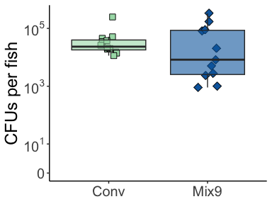

# About the Data

Mix9 Data from Trial 47. 11 fish  
Conv Data from Trial 54. 12 fish 


------------------------------------------------------------------------

# Setup

## Load libraries & configure


## Import and check data

### Conv 


```r
# import data
rawdataConv <- readxl::read_xlsx("CFUfishConvMix9.xlsx", sheet="Conv")

# format data
dataLB <- rawdataConv %>% 
   pivot_longer(LB_Rep1:LB_Rep3, names_to="LB_rep", values_to = "LB_CFU") %>% 
   drop_na() %>% 
   mutate(CFUperFish=LB_CFU*DF*(500/VolPlated_ul))


dataR2A <- rawdataConv %>% 
   pivot_longer(R2A_Rep1:R2A_Rep3, names_to="R2A_rep", values_to = "R2A_CFU") %>% 
   drop_na() %>% 
   mutate(CFUperFish=R2A_CFU*DF*(500/VolPlated_ul))

meandataConv <- rawdataConv %>% 
   pivot_longer(R2A_Rep1:R2A_Rep3, names_to="R2A_rep", values_to = "R2A") %>% 
   pivot_longer(LB_Rep1:LB_Rep3, names_to="LB_rep", values_to = "LB") %>% 
   group_by(Fish,FishNum,DF,VolPlated_ul) %>% 
   summarise_all(.funs="mean", na.rm=TRUE) %>% 
   pivot_longer(c(R2A,LB), names_to="Media", values_to="Raw_CFU") %>% 
   mutate(CFUperFish=Raw_CFU*DF*(500/VolPlated_ul)) %>% 
   group_by(Fish,FishNum,Media) %>% 
   summarise_all(.funs="mean", na.rm=TRUE)
```

### Mix9 with just LB data


```r
# import data
rawdataMix9 <- readxl::read_xlsx("CFUfishConvMix9.xlsx", sheet="Mix9")

# format data
dataMix9 <- rawdataMix9 %>% 
   group_by(Fish,FishNum)
```


### Group together


```r
alldata <- dataLB %>% mutate(Treatment="Conv on LB") %>% 
   full_join(dataR2A %>% mutate(Treatment="Conv on R2A")) %>% full_join(dataMix9)
```


------------------------------------------------------------------------

# All together


```r
alldata %>% 
   ggplot(aes(x=as.factor(FishNum), y=CFUperFish))+
   stat_summary(geom="col", stat="mean")+
   stat_summary(geom="errorbar", fun.data="mean_sd", width=0.2)+
   facet_grid(Fish~.)+
   scale_y_continuous(trans = 'log10', labels = trans_format('log10', math_format(10^.x)))+
   scale_fill_manual(values=c("grey20","darkred"))+
   theme(panel.grid.major.y = element_line(color="grey80"), 
         panel.grid.minor.y = element_line(color="grey90"), 
         strip.background = element_rect(colour = "transparent"))+
   labs(x=NULL, y="CFUs per fish (log scale)")
```

<!-- -->


```r
alldata %>% group_by(Fish, FishNum) %>% 
   summarise(meanCFUperFish=mean(CFUperFish, na.rm = TRUE)) %>% 
   ggplot(aes(x=Fish, y=meanCFUperFish, fill=Fish, shape=Fish))+
   geom_jitter(width=0.15, size=3, alpha=0.8, show.legend = FALSE)+
   geom_boxplot(alpha=0.8, show.legend = FALSE)+
   scale_fill_manual(values=c("red3","gold4")) +
   scale_shape_manual(values=c(22,23))+
   theme(panel.grid.major.y = element_line(color="grey80"), 
         panel.grid.minor.y = element_line(color="grey90"), 
         strip.background = element_rect(colour = "transparent"))+
   labs(x=NULL, y="CFUs per fish")
```

<!-- -->

```r
alldata %>% group_by(Fish, FishNum) %>% 
   filter(Fish!="Conv on R2A") %>% 
   summarise(meanCFUperFish=mean(CFUperFish, na.rm = TRUE)) %>% 
   ggplot(aes(x=Fish, y=meanCFUperFish, fill=Fish, shape=Fish))+
   geom_jitter(width=0.15, size=3, alpha=0.8, show.legend = FALSE)+
   geom_boxplot(alpha=0.8, show.legend = FALSE)+
   scale_fill_manual(values=c("red3","gold4")) +
   scale_shape_manual(values=c(22,23))+
   scale_y_continuous(trans = 'log10', labels = trans_format('log10', math_format(10^.x)))+
   theme(panel.grid.major.y = element_line(color="grey80"), 
         panel.grid.minor.y = element_line(color="grey90"), 
         strip.background = element_rect(colour = "transparent"))+
   labs(x=NULL, y="CFUs per fish (log scale)")
```

<!-- -->

